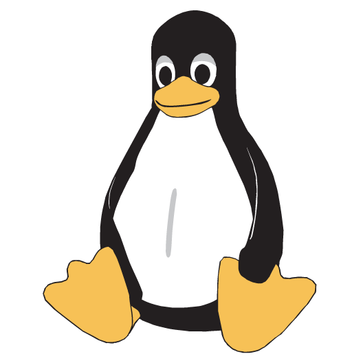

## :memo: DevOps Skilles:
<!--- ##### :memo: Communication and Collaboration.
##### :memo: Soft Skills and Noble Thought.
##### :memo: Understanding of Relevant Tools.
##### :memo: Security Skills.
##### :memo: Automation Skills.
##### :memo: Coding and Scripting.
##### :memo: Linux Fundamentals.
##### :memo: Infrastructure Management.
##### :memo: System Administration.
##### :memo: DevOps Toolchains.
##### :memo: Source Code Management.
##### :memo: Agile Methodologies.
##### :memo: Cloud Skills.
##### :memo: Testing Skills.
##### :memo: Customer-Focused Approach.
##### :memo: Proactiveness.
-->

<table id="skills" width="100%" border="0" cellpadding="0" cellspacing="0">
  <tr>
    <td align="left"><a href="#devops"><b> Communication and Collaboration.</b></a></td>
    <td align="left"><a href="#devops"><b> Soft Skills and Noble Thought.</b></a></td>
    <td align="left"><a href="#devops"><b> Understanding of Relevant Tools.</b></a></td>
    <td align="left"><a href="#devops"><b> Security Skills.</b></a></td>    
  </tr>
  <tr>
    <td align="left"><a href="#devops"><b>  Automation Skills.</b></a></td>
    <td align="left"><a href="#devops"><b> Coding and Scripting.</b></a></td>
    <td align="left"><a href="#devops"><b> Linux Fundamentals.</b></a></td>
    <td align="left"><a href="#devops"><b> Infrastructure Management.</b></a></td>
  </tr> 
  <tr>
    <td align="left"><a href="#devops"><b> System Administration.</b></a></td>
    <td align="left"><a href="#devops"><b> DevOps Toolchains.</b></a></td>
    <td align="left"><a href="#devops"><b> Source Code Management.</b></a></td>
    <td align="left"><a href="#devops"><b> Agile Methodologies.</b></a></td>
  </tr>  
  <tr>     
    <td align="left"><a href="#devops"><b> Cloud Skills.</b></a></td>
    <td align="left"><a href="#devops"><b> Testing Skills.</b></a></td>
    <td align="left"><a href="#devops"><b> Customer-Focused Approach.</b></a></td>
    <td align="left"><a href="#devops"><b> Proactiveness.</b></a></td>
  </tr>
</table>

# :memo: Languages and Tools:
****

<table id="skills" width="100%" border="0" cellpadding="0" cellspacing="0">
  <tr>
    <td align="center"><a href="#devops"> <b>DevOps</b></a></td>
    <td align="center"><a href="#devsecops"> <b>DevSecOps</b></a></td>
    <td align="center"><a href="#mlops"> <b>MLOps</b></a></td>
    <td align="center"><a href="#jenkins"> <b>Jenkins</b></a> </td>
    <td align="center"><a href="#git"> <b>Git</b></a> </td>
    <td align="center"><a href="#ansible"> <b>Ansible</b></a> </td>    
    <td align="center"><a href="#linux"> <b>Linux</b></a> </td>
    <td align="center"><a href="#terraform"> <b>Terraform</b></a> </td>
    <td align="center"><a href="#docker"> <b>Docker</b></a> </td> 
  </tr>
  <tr>
    <td align="center"><a href="#coding"> <b>Coding</b></a> </td>
    <td align="center"><a href="#python"> <b>Python</b></a> </td>
    <td align="center"><a href="#go"> <b>Go</b></a> </td>
    <td align="center"><a href="#shell-scripting"> <b>Shell Scripting</b></a> </td>
    <td align="center"><a href="#powershell"> <b>Powershell</b></a> </td>
    <td align="center"><a href="#kubernetes"> <b>Kubernetes</b></a> </td>
    <td align="center"><a href="#prometheus"> <b>Prometheus</b></a> </td>
    <td align="center"><a href="#mongo"> <b>Mongo</b></a> </td>
    <td align="center"><a href="#sql"> <b>SQL</b></a> </td>
  </tr>
  <tr>
    <td align="center"><a href="#rancher"> <b>Rancher</b></a> </td>
    <td align="center"><a href="#aws"> <b>AWS</b></a> </td>
    <td align="center"><a href="#gcp"> <b>GCP</b></a> </td>
    <td align="center"><a href="#azure"> <b>Azure</b></a> </td>    
    <td align="center"><a href="#openstack"> <b>OpenStack</b></a> </td>
    <td align="center"><a href="#security"> <b>Security</b></a> </td>
    <td align="center"><a href="#puppet"> <b>Puppet</b></a> </td>
    <td align="center"><a href="#openshift"> <b>OpenShift</b></a> </td>
    <td align="center"><a href="#dotnetcore"> <b>DotNetCore</b></a> </td>
  </tr>
  <tr>
    <td align="center"><a href="#monitoring"> <b>Monitoring</b></a> </td>
    <td align="center"><a href="#elastic"> <b>Elastic</b></a> </td>
    <td align="center"><a href="#jaeger"> <b>Jaeger</b></a> </td>
    <td align="center"><a href="#otel"> <b>Open Telemetry</b></a> </td>
    <td align="center"><a href="#thanos"> <b>Thanos</b></a> </td>  
    <td align="center"><a href="#grafana"> <b>Grafana</b></a> </td>  
    <td align="center"><a href="#java"> <b>Java</b></a> </td> 
    <td align="center"><a href="#ado"> <b>ADO</b></a> </td> 
    <td align="center"><a href="#helm"> <b>Helm</b></a> </td> 

  </tr>
</table>

